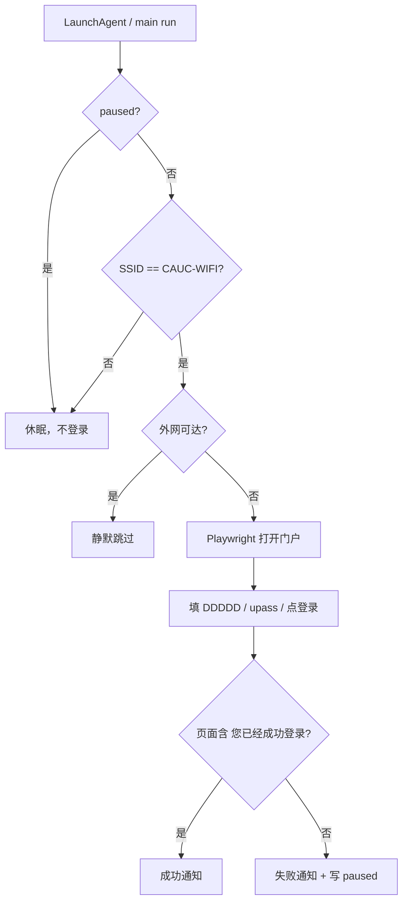

# CAUC 校园网自动登录 — 技术方案

> 依据已定 `需求.md`（PRD）。产品决策不得在本方案中推翻。

---

## 1. 技术选型结论

| 层级 | 选型 | 理由（对应 PRD） |
|------|------|------------------|
| 语言 | **Python 3.11+** | macOS 自带或可 `brew install`；同学克隆后 `pip install -r requirements.txt` 即可，符合 `share_template` |
| 浏览器自动化 | **Playwright（Chromium headless）** | `q_browser_visibility=headless`；门户为动态 ePortal 页，需真实 DOM；字段 `DDDDD` / `upass` / `0MKKey` 已实测 |
| WiFi / 触发 | **轮询当前 SSID**（`networksetup` / `wdutil`） | `q_trigger_when=on_wifi_connect`；macOS 无稳定「WiFi 已连接」公开事件给普通脚本，轮询 15–30s 足够且实现简单 |
| 连通性预检 | **HTTP 探测外网**（如 Apple captive 检测 URL） | `q_already_logged_in=check_silent`：能访问外网则**不**开门户 |
| 凭据 | **本机 YAML** `config.local.yaml`（gitignore） | `q_credential_handling=local_config`；提供 `config.example.yaml` 作模板 |
| 通知 | **macOS `osascript` display notification** | `notify` / `notify_brief`；无额外守护进程依赖 |
| 开机自启 | **LaunchAgent**（`~/Library/LaunchAgents/`） | 粗糙需求「开机自启动」；`KeepAlive` + 轮询脚本 |
| 失败策略 | **状态文件熔断**（`state/paused`） | `q_failure_feedback=notify`：失败后写 paused，人工删除或 `resume` 子命令后再跑 |

**不选**：纯 `curl` 提交表单（ePortal 常带 JS/跳转）、Selenium 单独维护、钥匙串首版（PRD 已定 local_config，后续可作 M06 增强）。

---

## 2. 项目结构

```
wifiCAUC/
├── README.md                 # 安装、配置、同学模板说明
├── requirements.txt          # playwright, pyyaml
├── config.example.yaml       # 模板（SSID、门户 URL、选择器）
├── config.local.yaml         # 用户本机配置（.gitignore，含账号密码）
├── 账号密码.md               # 可选：人工备忘，不入 Git
├── src/
│   └── wificauc/
│       ├── __init__.py
│       ├── config.py         # 加载/校验配置
│       ├── wifi.py           # 当前 SSID 是否为 CAUC-WIFI
│       ├── connectivity.py   # 外网可达性检测
│       ├── portal.py         # Playwright 填表登录
│       ├── notify.py         # macOS 通知
│       ├── state.py          # paused、上次结果
│       └── main.py           # CLI：run / once / resume / status
├── scripts/
│   ├── install-launchagent.sh
│   └── uninstall-launchagent.sh
├── launchd/
│   └── com.wificauc.agent.plist.template
├── state/                    # 运行时状态（.gitignore）
│   └── .gitkeep
├── plan/                     # 本目录
├── 需求.md
└── 元素.md                   # 门户 DOM 参考
```

---

## 3. 运行与部署

### 3.1 本地开发

```bash
cd /path/to/wifiCAUC
python3 -m venv .venv && source .venv/bin/activate
pip install -r requirements.txt
playwright install chromium
cp config.example.yaml config.local.yaml   # 编辑账号密码
python -m wificauc.main once               # 手动跑一轮
```

### 3.2 常驻（LaunchAgent）

- `scripts/install-launchagent.sh` 将 plist 拷到 `~/Library/LaunchAgents/`，`ProgramArguments` 指向 venv 内 `python -m wificauc.main run`。
- `run` 模式：循环 sleep（默认 20s）→ 若 SSID 匹配且未 paused → `connectivity` → 必要时 `portal.login()`。
- 日志：`~/Library/Logs/wifiCAUC/agent.log`（stdout/stderr）。

### 3.3 同学模板用法

1. `git clone` → `cp config.example.yaml config.local.yaml` → 填自己的 `username` / `password`。
2. 执行安装脚本装 LaunchAgent。
3. **勿**把 `config.local.yaml` 提交到 Git（已在 `.gitignore`）。

---

## 4. 数据流



### 4.1 配置（`config.local.yaml`）

```yaml
wifi:
  ssid: "CAUC-WIFI"
portal:
  url: "http://192.168.4.252/"
  selectors:
    username: 'input[name="DDDDD"]'
    password: 'input[name="upass"]'
    submit: 'input[name="0MKKey"]'
  success_text: "您已经成功登录"
credentials:
  username: "学号或账号"
  password: "密码"
runtime:
  poll_interval_seconds: 20
  connectivity_urls:
    - "http://captive.apple.com/hotspot-detect.html"
  headless: true
  portal_timeout_seconds: 30
```

### 4.2 门户登录（`portal.py`）

1. `chromium.launch(headless=True)` → `page.goto(portal.url)`。
2. `page.fill(username)` / `page.fill(password)`。
3. **仅** `page.click(submit)`；**禁止**点击含「注销」文案或 logout 的 selector（代码层黑名单）。
4. `page.wait_for_selector` 或 `get_by_text(success_text)`。
5. 关闭 browser context。

### 4.3 连通性（`connectivity.py`）

- 对 `connectivity_urls` 发起 GET，`timeout` 3s；任一返回体含 `Success`（Apple 检测页）或 HTTP 200 且非门户重定向 → 视为已上网。
- 若被重定向到 `192.168.4.252` → 视为需登录。

### 4.4 状态（`state/`）

| 文件 | 含义 |
|------|------|
| `paused` | 存在则不再自动登录，直至 `main resume` |
| `last_run.json` | 上次时间、结果 success/fail/skipped |

---

## 5. 与 PRD 的对应表

| PRD §6 决策 | 实现要点 |
|-------------|----------|
| `on_wifi_connect` | SSID 轮询；变为 CAUC-WIFI 时立即跑一轮（不必等下一周期） |
| `check_silent` | 先 `connectivity.check()`，通过则不开 Playwright |
| `notify`（失败） | `notify.py` + 写 `state/paused`；日志记录原因 |
| `notify_brief`（成功） | 一条 notification：「CAUC 校园网：已成功登录」 |
| `local_config` | `config.local.yaml` + example 模板；chmod 600 建议写进 README |
| `headless` | Playwright `headless=True` |
| `share_template` | README + `config.example.yaml` + install 脚本 |
| `never_click_only` | `portal.py` 白名单仅 submit；不查询/点击 logout |

---

## 6. 风险与对策

| 风险 | 对策 |
|------|------|
| 门户改版导致选择器失效 | 选择器集中在 YAML；`元素.md` 作回归参考；失败进 paused |
| Playwright 首次需下载 Chromium | README 写明 `playwright install chromium` |
| `networksetup` 需完整磁盘访问 / 定位权限 | README 说明；可提供 `wifi.ssid` 手动覆盖调试 |
| 学校更换门户 IP | 仅改 `portal.url` |
| 误点注销 | 代码禁止点击注销；E2E 用例断言无 logout click |

---

## 7. 模块划分（见 `plan/Mxx-*.md`）

| 模块 | 文件 | 依赖 |
|------|------|------|
| M01 | 项目骨架与配置 | — |
| M02 | 网络检测与连通性预检 | M01 |
| M03 | 门户自动登录 | M01 |
| M04 | 通知与失败熔断 | M01 |
| M05 | LaunchAgent 与模板文档 | M01–M04 |
